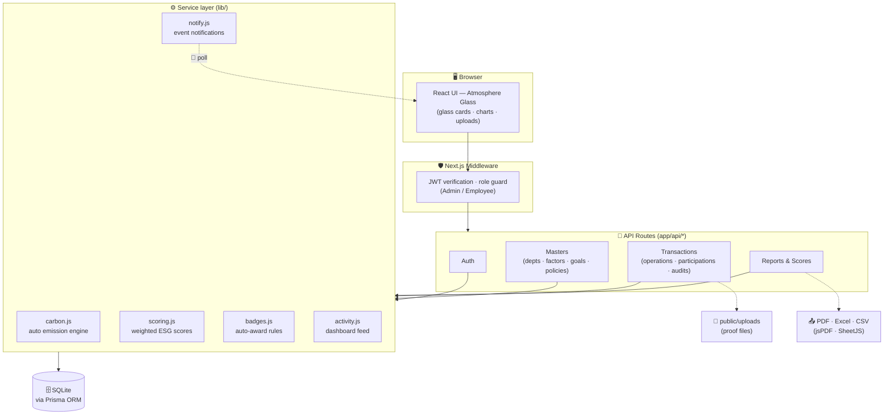
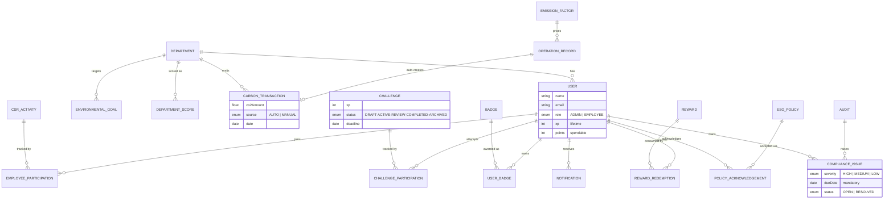
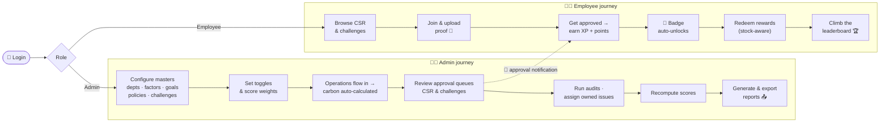

<div align="center">


# 🌿 EcoSphere

### *Measure, manage and improve Environmental, Social & Governance performance — with gamification built in.*


🏷 `esg` `sustainability` `carbon-accounting` `nextjs` `prisma` `tailwindcss` `gamification` `dashboard` `hackathon`

**🔗 Quick links:** [📹 Demo video](https://example.com/demo-video) · [⚡ Setup](#-getting-started) · [🏗 Architecture](#-system-architecture)

</div>

---

## 📖 Description

ESG has become a critical aspect of modern business — organizations are expected to monitor carbon emissions, promote employee well-being, and maintain governance compliance. Yet while ERP systems collect plenty of operational data, ESG reporting today is **manual, disconnected, and impossible to monitor in real time**. Sustainability lives in spreadsheets, compliance lives in emails, and leadership sees the picture months too late.

**EcoSphere plugs ESG directly into day-to-day operations.** ERP-style operations (purchases, manufacturing, fleet, expenses) auto-convert into carbon transactions through configurable emission factors. Employees participate through CSR activities and gamified challenges — earning XP, unlocking badges, and redeeming rewards. Governance stays on track with policies, audits, and owned compliance issues. Everything rolls up into a **weighted, live-scored executive dashboard** with full reporting and PDF / Excel / CSV exports.

> ✨ **At a glance** — 7 modules · 20+ data models · 6 server-enforced business rules · 4 standard reports + custom builder · 3 export formats · role-based access · 100% dynamic (zero static data)

---

## 📑 Table of contents

- [✨ Key features](#-key-features)
- [🔒 Enforced business rules](#-enforced-business-rules)
- [🛠 Tech stack](#-tech-stack)
- [🏗 System architecture](#-system-architecture)
- [🧮 How scoring works](#-how-scoring-works)
- [🔄 User flow](#-user-flow)
- [⚡ Getting started](#-getting-started)
- [📸 Screenshots](#-screenshots)
- [📁 Project structure](#-project-structure)
- [📚 Project documentation](#-project-documentation)
- [🏆 Hackathon](#-hackathon)
- [👥 Team Kuro Niko](#-team-kuro-niko)
- [🗺 Roadmap](#-roadmap)
- [📄 License](#-license)

---

## ✨ Key features

### 🌿 Environmental
- **Emission factors** master — per-unit CO₂ values across Purchase / Manufacturing / Fleet / Expense sources
- **Auto carbon accounting** — logging an operation instantly creates a calculated carbon transaction (quantity × factor)
- **Environmental goals** with live progress bars, deadlines, and auto status suggestions, synced from real transaction data
- **Product ESG profiles** — carbon footprint, recyclability % and A–E sustainability ratings per product
- Department-wise carbon tracking with 6-month trend charts

### 🤝 Social
- **CSR activities** as joinable cards with points rewards and join counts
- **Proof-based participation** — employees upload evidence (image/PDF), admins approve or reject from a queue
- Points credited automatically on approval, with in-app notifications
- **Diversity dashboard** — gender split, per-department participation rates, and training completion metrics

### 🏛 Governance
- **ESG policies** with versioning and one-click employee acknowledgements
- Acknowledgement tracking per policy with **reminder notifications** to pending employees
- **Audits** register with findings and status workflow
- **Compliance issues** — severity-tagged, always owned, always dated, with automatic **overdue flagging**

### 🎮 Gamification
- **Challenges** with a strict lifecycle: `Draft → Active → Under Review → Completed` (Archive any time) — illegal jumps rejected server-side
- Progress tracking + proof uploads, XP awarded on approval
- **Badges** that auto-unlock the moment an XP / completion rule is satisfied
- **Rewards catalog** with stock-aware, points-deducting redemption
- **Leaderboards** for employees and departments, live from the database

### 📊 Dashboard & scoring
- Executive dashboard with **live KPI tiles** (E / S / G / Overall), trend arrows, and click-through to modules
- 12-month emissions trend and department ESG ranking charts
- Recent activity feed aggregating events from every module
- One-click **score recompute** with configurable weights

### 📑 Reports
- Environmental, Social, Governance and ESG Summary reports
- **Custom report builder** with six filter dimensions: date range, department, module, employee, challenge, ESG category
- Every report exports to **PDF, Excel, and CSV**

### ⚙️ Settings & administration
- Departments (with hierarchy), categories, and employees management
- **ESG configuration** — business-rule toggles + score weight configuration (must total 100)
- Notification settings with per-event control
- **Blank company mode** — spin up an empty org and onboard everything through the UI

---

## 🔒 Enforced business rules

Six rules from the problem statement are **mandatory, server-enforced behavior** — not UI decoration:

| # | Rule | Where it lives | What it does |
|---|------|----------------|--------------|
| 1 | **Auto Emission Calculation** | `lib/carbon.js` | When the toggle is ON, every operation auto-creates a carbon transaction (`quantity × co2PerUnit`) in the same DB transaction. OFF → manual conversion flow. |
| 2 | **Evidence Requirement** | `app/api/participations/*` | Approval API returns `422 Evidence required` if proof is missing on an evidence-required activity — the button is disabled *and* the server refuses. |
| 3 | **Badge Auto-Award** | `lib/badges.js` | `checkAndAwardBadges()` runs after every XP credit; unlock rules (XP threshold / challenges / CSR count) fire instantly with a 🏅 notification. |
| 4 | **Reward Redemption** | `app/api/rewards/redeem` | Single DB transaction: validates balance ≥ cost and stock > 0, deducts points, decrements stock — both failure paths return clear `422`s. |
| 5 | **Compliance Issue Ownership** | `app/api/compliance/*` | Owner + due date are mandatory at creation; open issues past due date get an OVERDUE flag and a one-time owner notification. |
| 6 | **Notification System** | `lib/notify.js` | In-app notifications for compliance issues, approval decisions, policy reminders, and badge unlocks — each event type toggleable in Settings. |

---

## 🛠 Tech stack

| Layer | Technology | Why |
|-------|------------|-----|
| Framework | **Next.js 14** (App Router) | One repo for UI + API, server components, file-based routing |
| Styling | **Tailwind CSS** + custom **"Atmosphere Glass"** design system | Token-driven glassmorphism — photographic heroes, frosted cards, module accent system |
| Database | **SQLite** via **Prisma ORM** | A real relational database with zero setup — perfect for an 8-hour sprint and instant local demo |
| Auth | **JWT** in httpOnly cookies + Next.js middleware | Role-based access (Admin / Employee) enforced at the edge |
| Charts | **Recharts** | Gradient area fills, glass tooltips, responsive |
| Exports | **SheetJS** (Excel) · **jsPDF + autotable** (PDF) · native CSV | All three formats for every report |
| Uploads | Multipart → `public/uploads` | Local proof storage for CSR & challenge evidence |
| Typography | Space Grotesk · Inter · Instrument Serif | Mixed-weight editorial display with tabular numerals |

---

## 🏗 System architecture



### 🗄 Core data model



---

## 🧮 How scoring works

All formulas live in `lib/scoring.js`, computed per department per period (0–100):

```text
Environmental = 0.6 × avgGoalProgress + 0.4 × emissionTrendScore
                (trend rewards emitting less than your 3-month average)

Social        = 0.6 × participationRate + 0.4 × trainingCompletion

Governance    = 0.4 × policyAckRate + 0.3 × auditCompletionRate
              + 0.3 × issueResolutionScore   (−10 per overdue open issue)

DeptTotal     = (wE × E + wS × S + wG × G) / 100     ← weights configurable in Settings
Overall ESG   = mean of all department totals
```

> 🧪 **Sanity check against the approved mockup:** with default weights `40 / 30 / 30` →
> `82 × 0.40 + 74 × 0.30 + 88 × 0.30 = 81.4 ≈ 81` — exactly the Overall ESG tile. The math is real.

**XP vs Points:** approvals credit **both** equally. `XP` is lifetime — it drives leaderboards and badge unlocks and never decreases. `Points` are spendable — reward redemption deducts points only.

---

## 🔄 User flow



---

## ⚡ Getting started

**Prerequisites:** Node 20+ and npm.

```bash
# 1. Clone
git clone https://github.com/ChibiClicks/ecosphere-esg.git
cd ecosphere-esg

# 2. Install
npm install

# 3. Environment — create .env in the root
echo 'DATABASE_URL="file:./dev.db"' > .env
node -e "console.log('JWT_SECRET=\"'+require('crypto').randomBytes(32).toString('hex')+'\"')" >> .env

# 4. Database — schema + full demo dataset
npm run db:reset

# 5. Run
npm run dev
# → http://localhost:3000
```

### 🔑 Demo credentials

| Role | Email | Password |
|------|-------|----------|
| 👨‍💼 Admin | `admin@ecosphere.io` | `Admin@123` |
| 🧑‍🔧 Employee | `aditi@ecosphere.io` | `Emp@123` |

### 🏢 Blank company mode

Want to onboard a fresh organization from zero through the UI alone?

```bash
npm run db:init   # empty org — just settings + one admin login
```

### 📜 Scripts

| Script | What it does |
|--------|--------------|
| `npm run dev` | Start the dev server on :3000 |
| `npm run build` | Production build (must pass clean) |
| `npm run db:push` | Sync Prisma schema to SQLite |
| `npm run db:seed` | Load the full demo dataset |
| `npm run db:reset` | Fresh schema + seed in one shot |
| `npm run db:init` | Blank company mode (admin only, no demo data) |
| `npm run test:e2e` | Playwright golden-path suite *(optional)* |

---

## 📸 Screenshots

<table>
  <tr>
    <td align="center"><br/><sub>🔐 Login — full-bleed atmosphere + glass card</sub></td>
    <td align="center"><br/><sub>📊 Executive dashboard — live ESG weather</sub></td>
  </tr>
  <tr>
    <td align="center"><br/><sub>🌿 Environmental goals with live progress</sub></td>
    <td align="center"><br/><sub>🏭 Auto-calculated carbon transactions</sub></td>
  </tr>
  <tr>
    <td align="center"><br/><sub>🤝 Evidence-enforced approval queue</sub></td>
    <td align="center"><br/><sub>🎮 Challenge lifecycle & filters</sub></td>
  </tr>
  <tr>
    <td align="center"><br/><sub>🏛 Owned, dated, overdue-flagged issues</sub></td>
    <td align="center"><br/><sub>📑 Reports hub + custom builder</sub></td>
  </tr>
</table>

<div align="center">
  
  
  <br/><sub>📱 Fully responsive — drawer navigation, stacked tiles</sub>
</div>

---

## 📁 Project structure

<details>
<summary><b>📂 Click to expand</b></summary>

```text
ecosphere-esg/
├── app/
│   ├── (auth)/login/          # Public login page
│   ├── api/                   # All API routes (auth, masters, transactions, reports)
│   ├── environmental/         # Factors · products · carbon · goals
│   ├── social/                # CSR · participation · diversity
│   ├── governance/            # Policies · acknowledgements · audits · compliance
│   ├── gamification/          # Challenges · badges · rewards · leaderboard
│   ├── reports/               # 4 standard reports + custom builder
│   ├── settings/              # Departments · categories · ESG config · notifications
│   └── page.jsx               # Executive dashboard (post-login landing)
├── components/ui/             # Atmosphere Glass kit — cards, pills, tables, modals…
├── lib/                       # carbon.js · scoring.js · badges.js · notify.js · auth.js
├── prisma/
│   ├── schema.prisma          # 20+ models — full ESG data model
│   └── seed.js                # Mockup-exact demo dataset
├── public/
│   ├── images/                # Hero photography (nature ↔ industry)
│   └── uploads/               # Proof files (CSR & challenge evidence)
├── docs/                      # Banner, screenshots, design shots
├── DEMO.md                    # 5-minute judge walkthrough
├── ASSUMPTIONS.md             # Documented build assumptions
└── middleware.js              # JWT gate for every protected route
```

</details>

---

## 📚 Project documentation

- 🎬 **[DEMO.md](DEMO.md)** — the 5-minute judge walkthrough hitting every business rule live
- 📝 **[ASSUMPTIONS.md](ASSUMPTIONS.md)** — every assumption made where the spec left room
- 🎨 **docs/design/** — design-system screenshots (desktop + mobile)

<details>
<summary><b>🔌 API overview</b></summary>

| Area | Base route | Key endpoints |
|------|-----------|---------------|
| Auth | `/api/auth` | `POST /login` · `POST /logout` |
| Settings | `/api/settings` | `GET` · `PATCH` (toggles + weights) |
| Masters | `/api/departments` · `/api/categories` · `/api/employees` | full CRUD |
| Environmental | `/api/emission-factors` · `/api/products` · `/api/goals` | CRUD + `POST /goals/:id/recompute` |
| Carbon | `/api/operations` · `/api/carbon-transactions` | create (auto-engine) · list w/ filters · convert |
| Social | `/api/csr-activities` · `/api/participations` · `/api/upload` | join · proof · `POST /:id/approve` (rule #2) |
| Governance | `/api/policies` · `/api/acknowledgements` · `/api/audits` · `/api/compliance` | ack · remind · overdue-scan |
| Gamification | `/api/challenges` · `/api/challenge-participations` · `/api/badges` · `/api/rewards` | lifecycle transitions · `POST /rewards/:id/redeem` |
| Scoring | `/api/scores` | `POST /recompute` |
| Reports | `/api/reports/custom` | filtered query + export payloads |
| Notifications | `/api/notifications` | list · mark read · mark all |

</details>

### 🧪 Testing

- **Manual E2E:** a 40-check "fresh company onboarding" script (masters → operations → carbon → approvals → scores → reports) — every Section-8 rule verified with expected values.
- **Automated:** `npm run test:e2e` runs the Playwright golden-path suite headlessly *(if configured)*.
- **The 30-second dynamic proof:** `npx prisma studio` → edit any value in the DB → refresh the UI. Single source of truth, zero hardcoding.

---

## 🏆 Hackathon

Built **end-to-end in a single 8-hour sprint** for the **Odoo Hackathon 2026** — foundation to final polish, with a fully progressive [commit history](../../commits/main) as proof of the build journey. Every requirement of the EcoSphere problem statement is implemented, including all six mandatory business rules from Section 8.

---

## 👥 Team Kuro Niko

| Member | Role | GitHub |
|--------|------|--------|
| **Aditya Raulji** | 🧭 Team Leader — Full-stack & AI-agent workflow | [@aditya-raulji](https://github.com/aditya-raulji) |
| **Rijans Patoliya** | 💻 Full-stack Developer | [@rijans-patoliya](https://github.com/RijansPatoliya) |

---

## 🗺 Roadmap

- 📧 SMTP email delivery for the notification system
- 🔌 Live ERP connectors (purchase / fleet / expense APIs) replacing the operations simulator
- 📱 PWA install + offline dashboard
- 🏢 Multi-organization tenancy with per-org weighting
- 🤖 AI-assisted ESG insights ("why did Logistics drop 6 points this month?")

---

## 📄 License

Released under the **MIT License** — see [LICENSE](LICENSE) for details.

---

<div align="center">

**Built with 🌱 by Team Kuro Niko**

*EcoSphere — because what gets measured, gets managed.*

</div>